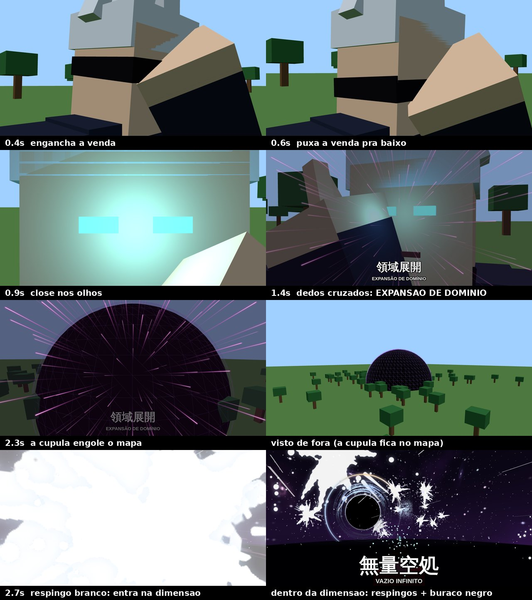

# Expansão de Domínio: Vazio Infinito (Roblox)

É um golpe de **personagem**, feito para ficar no modelo do Gojo do seu jogo. Referência: JJK episódio 7 (Gojo × Jogo).



O `preview_domain.gif` mostra a sequência animada. É uma prévia 3D com um boneco de blocos no lugar do seu Gojo.

## A cena (tempos em `Config.Timeline`)

| Tempo | O que acontece |
|---|---|
| 0.0 s | Close no rosto, de três quartos |
| 0.1–0.8 s | A mão esquerda engancha a venda nos olhos e **puxa pra baixo**; ela fica pendurada no pescoço |
| 0.72 s | **Close extremo nos olhos**, que acendem azuis (brilho, luz e faíscas) |
| 1.05 s | De frente: a mão direita sobe **ao lado do rosto** com os dedos cruzados |
| 1.35 s | "Tic" dos dedos: túnel de linhas de velocidade e **領域展開 / EXPANSÃO DE DOMÍNIO** |
| 1.7–2.7 s | A cúpula preta explode no mapa e a câmera recua na frente da parede |
| 2.7 s | **Respingo branco** cobre a tela. Quem lançou e os alvos vão para a **dimensão** |
| na dimensão | Céu do vazio, chão espelhado como água, **respingos brancos** estourando pelo espaço, correntes de luz branca, poeira de estrelas e o **buraco negro** atrás do Gojo. Aparece **無量空処 / VAZIO INFINITO** |
| alvos | Travados e sem controle. A tela fica tomada por ruído de informação, com flashes, **respingos na tela**, blur e tremor. Todos veem faíscas na cabeça deles |
| fim | O vazio quebra, todos voltam pro lugar exato onde estavam no mapa e a venda volta pros olhos |

**Sobre a dimensão:**
- Todo mundo dentro do raio na hora que o domínio fecha é levado para uma área longe do mapa (`Config.DimensionOrigin`), mantendo a distância que tinha do Gojo.
- No mapa fica só a cúpula preta, que é o que quem está de fora vê.
- Com `Config.UseDimension = false`, o domínio acontece dentro da cúpula, no próprio mapa.

**Sobre a pose:**
- É gerada girando as juntas do R15 (`Motor6D.C0`) em todos os clientes com o mesmo relógio, então **não precisa subir animação**.
- Os ângulos foram calculados para as mãos pararem na frente dos olhos e ao lado do rosto, não dentro da cabeça.
- Os dedos cruzados são duas peças soldadas na mão.

## O que tem aqui

| Arquivo | Para que serve |
|---|---|
| `PocketVanguardsDomain.rbxmx` | Pasta `PVDomain`: `DomainServer` (Server), `DomainClient` (Client), `DomainConfig`, `DomainVFX`, `DomainCinematic` |
| `SatoruPlaceholder.rbxmx` | **Placeholder** do Gojo (R15, cabelo branco, venda). Tem um botão "Testar Expansão de Domínio" (segure E). **Apague quando o seu Gojo estiver no jogo** |
| `images/` | 18 imagens: céu (6), buraco negro (4), respingos (4), linhas, brilho, partícula e ruído |
| `sounds/` | 5 sons (síntese original): cena, lançamento, vazio em loop, sobrecarga em loop, quebra |
| `src/` + `default.project.json` | Para Rojo |
| `tools/` | Scripts que geraram imagens, sons e o placeholder |

## Instalar

1. Arraste `PocketVanguardsDomain.rbxmx` para **ReplicatedStorage**.
2. **Asset Manager → Bulk Import:** as 18 imagens e os 5 sons. Cole os IDs em `PVDomain.DomainConfig`, em `Images` e `Sounds`.
3. Para testar: arraste `SatoruPlaceholder.rbxmx` para **Workspace**, dê Play, chegue perto e segure **E**.

## Colocar no seu Gojo

1. **Nome:** o modelo do Gojo precisa se chamar `Satoru`, ou ter o atributo `PVCharacter = "Satoru"`. Se preferir outro nome, troque a chave em `Config.Characters`.
2. **Venda:** a venda precisa ser um Accessory (ou peça soldada na cabeça) com o nome que está em `mask` (padrão: `Blindfold`).
3. **Ajuste o perfil ao seu modelo:**
   ```lua
   Satoru = {
       mask = "Blindfold",                     -- nome da venda
       eyeColor = Color3.fromRGB(110, 220, 255),
       eyes = Vector2.new(0.16, 0.1),          -- olhos: afastamento e altura (fração do tamanho da Head)
       maskDrop = 0.62,                        -- quanto a venda desce (fração da altura da cabeça)
       fakeMask = true,                        -- cria uma venda preta se o modelo não tiver
   },
   ```
4. **Apague o placeholder.**

## Lançar

- **Jogador com o Gojo:** tecla **G**, **Y** no controle ou o botão 領域 no celular. Com `Config.AllowPlayers = false`, só o servidor lança.
- **Servidor (boss, NPC ou sistema de batalha):**
  ```lua
  local PVDomain = game.ReplicatedStorage:WaitForChild("PVDomain")
  PVDomain.CastDomain:Fire(modeloDoGojo)
  PVDomain.DomainStarted.Event:Connect(function(id, caster, alvos) end) -- ex.: alvos perdem turnos
  PVDomain.DomainEnded.Event:Connect(function(id, caster, alvos) end)
  ```

## Regras (`DomainConfig`)

- `Radius = 60`: tamanho da cúpula.
- `Duration = 10`: segundos dentro do vazio.
- `Cooldown = 30`: conta por jogador, não reseta ao renascer.
- `AnchorTargets = true`: alvos ficam parados de verdade.
- Se o Gojo morrer ou sair, o domínio acaba na hora e todos voltam pro mapa.
- Vários domínios ao mesmo tempo ficam em dimensões separadas (`DimensionSpacing`).
- Jogos com **StreamingEnabled**: o servidor pede o carregamento da dimensão antes de levar os jogadores.

## Observações

- **Precisa de R15** para a pose. Em R6 a câmera, a dimensão e os efeitos funcionam, mas os braços não se mexem.
- **Área da dimensão:** fica em `Y = 4000`. Se o seu mapa usar essa área, troque `DimensionOrigin`.
- **Nomes:** "Vazio Infinito" e 無量空処 são de Jujutsu Kaisen. Para jogo público, dá pra trocar em `Config.Title`. Visual, sons, modelo e código são originais.
- **O que foi testado:**
  - Num emulador de Roblox (lune), com servidor e cliente juntos: **58 checagens**, rodadas com um rig de teste e **com o próprio `SatoruPlaceholder.rbxmx` carregado**.
  - Cobrem a cena, a câmera, a venda descendo, os olhos, os dedos, a ida e a volta da dimensão, os respingos e as correntes, a trava dos alvos, a iluminação, a morte no meio da cena e a limpeza.
  - A prévia 3D usa a mesma matemática.
  - O Studio em si não roda aqui. O ajuste fino do enquadramento para o seu modelo fica em `Cine:update` (`DomainCinematic`).
