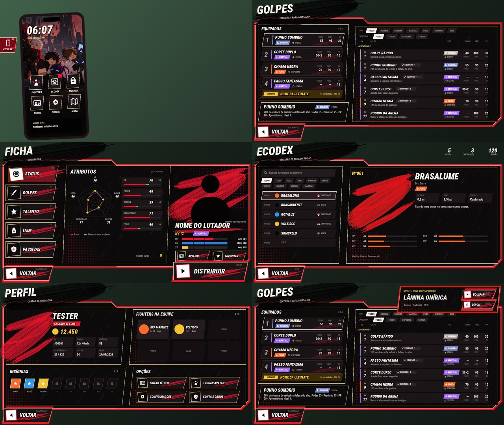

# HUD do Pocket Vanguards (Roblox)

O mesmo visual das telas do jogo (moldura vermelha e dourada, pinceladas, chuva e retícula) feito em Luau:

- **Celular:** aba na borda esquerda (tecla **M**). Apps: Fighters, Ecodex, Mochila, Perfil, Config. e Mapa. O widget de missão fica no próprio celular.
- **Golpes:** 4 slots e a ultimate, lista de aprendidos e bloqueados com filtros.
  - Troca por clique ou teclado.
  - Troca arrastando: golpe → slot, slot → golpe e slot → slot.
  - Aviso de golpe novo com "Equipar agora" / "Depois".
- **Ficha do lutador:** abas Status (radar), Golpes, Talento, Item (com gaveta de itens) e Passivas, mais Apelido e Favoritar.
- **Ecodex:** busca, filtro por tipo, ficha da criatura e contadores.
- **Perfil do treinador:** cartão, dinheiro, insígnias, equipe e opções.
- **Voltar:** em todas as telas.



## O que tem aqui

| Arquivo | Para que serve |
|---|---|
| `PocketVanguardsHudKit.rbxmx` | Pacote pronto: pasta `PVHudKit` com 9 módulos e o script `PVHudBoot` |
| `images/` | 10 imagens: `tris`, `icons`, `tex_rain`, `tex_halftone`, 5 pinceladas `brush_*` e o `wallpaper` do celular |
| `sounds/pv_ui.wav` | Sons de menu. É o **mesmo arquivo da intro**: se já subiu, reaproveite o ID |
| `src/` + `default.project.json` | O mesmo código, para quem usa Rojo |

## Instalar

1. No Studio, arraste `PocketVanguardsHudKit.rbxmx` para dentro de **ReplicatedStorage**.
   - O `PVHudBoot` já vem com `RunContext = Client`, então roda dali mesmo.
2. **Asset Manager → Bulk Import:** importe as 10 imagens de `images/` e o `pv_ui.wav`.
3. Abra `ReplicatedStorage.PVHudKit.PVHudConfig` e troque cada `rbxassetid://0` pelo ID certo. Para pegar o ID: botão direito no asset → **Copy Asset ID**.
4. Dê Play e aperte **M** (ou clique na aba **CELULAR**).

Se a intro estiver no jogo, a HUD espera ela terminar para aparecer.

## Ligar nos dados do seu jogo

A HUD lê tudo de um arquivo só: **`PVData`**. Hoje ele tem dados de exemplo. Troque o corpo de cada função pelos seus sistemas; não precisa mexer nas telas.

| Função | O que devolve ou faz |
|---|---|
| `getFighter()` | Lutador aberto na ficha: `name`, `level`, `typeKey`, `hp`/`en`/`xp` como `{atual, máx}`, `stats`, `talent`, `passives`, `item`, `ultimate`. Opcional: `portrait` (imagem) ou `portraitModel` (Model 3D) |
| `setFavorite(on)`, `setNickname()` | Botões Favoritar e Apelido |
| `getMoves()` | `{ list = todos os golpes, equipped = {4 ids}, level = nível }` |
| `equipMove(slot, id)`, `swapSlots(a, b)` | Salvam a troca. Devolva `true` se deu certo |
| `getHeldItems()`, `equipItem(id)`, `removeItem()` | Itens de segurar (vêm da mochila) |
| `getDex()` | `{ seen, caught, total, entries }`. Cada entrada: `no`, `name`, `types`, `status` (`"caught"`, `"seen"` ou `"unknown"`), `kind`, `desc`, `stats`, `habitat`, `image` |
| `getProfile()` | Cartão do treinador: nome, título, dinheiro, insígnias e números. A equipe tem 6 posições; use `false` para vaga |
| `profileOption(nome)` | Botões do perfil: `"title"`, `"avatar"`, `"account"` |

Quando um dado mudar **fora** da HUD (ganhou XP, capturou algo), avise:

```lua
local PVData = require(game.ReplicatedStorage.PVHudKit.PVData)
PVData.Changed:Fire("moves") -- ou "fighter", "dex", "profile"
```

Salvar de verdade é no **servidor**. Nas funções de escrita (`equipMove`, `equipItem`...), mande um RemoteEvent e deixe o servidor validar.

## Abrir telas pelo código

```lua
local Hud = require(game.ReplicatedStorage.PVHudKit.PVHud)

Hud.open("ficha")      -- "moves", "ficha", "ecodex", "perfil"
Hud.close()
Hud.learnMove("oni")   -- subiu de nível: abre Golpes com o aviso "Equipar agora / Depois"
Hud.setMission("Encontrar o Nico no Círculo de Pedra")
if Hud.isOpen() then --[[ trave o personagem, esconda a sua HUD... ]] end

-- apps que abrem telas que você já tem (Mochila, Config., Mapa)
Hud.AppOpened.Event:Connect(function(appId)
	if appId == "bag" then --[[ abra a sua mochila ]] end
end)
```

## Controles

| Ação | Teclado | Controle | Mouse / toque |
|---|---|---|---|
| Celular | M | Select | Aba CELULAR |
| Voltar | Backspace | B | Botão VOLTAR |
| Confirmar | Enter | A | Clique |
| Navegar | Setas | D-pad | — |
| Aba anterior / próxima | Q / E | LB / RB | Clique na aba |
| Slot 1–4 (Golpes) | 1–4 | — | Clique ou arrastar |
| Buscar (Ecodex) | / | — | Caixa de busca |

**Esc** não é usado porque o Roblox reserva essa tecla para o menu dele.

## Ajustes no `PVHudConfig`

- `DisplayFont`: fonte dos títulos. Hoje é Roboto Condensed Heavy Itálico, que já vem no Roblox.
- `PhoneApps`: ordem, nome e ícone dos apps.
- `PhoneKey`: tecla do celular.
- `ReducedMotion = true`: desliga as animações.
- Cores: tabela `S.C` no topo do `PVStyle`.

## Observação honesta

Não dá para abrir o Roblox Studio daqui. O que foi testado:

- **Emulador de Roblox (lune):** todas as telas foram montadas com as classes e propriedades reais do Roblox, e passaram 31 testes, com animação ligada e desligada. Os testes cobrem abrir e fechar, cada botão, teclado, arrastar para trocar (slot → slot e golpe → slot), aviso de golpe novo, Voltar e os apps do celular.
- **`preview.jpg`:** foi desenhado a partir da árvore de objetos que o emulador montou. É uma prévia fiel do layout, não uma captura do Studio.

Se algo aparecer sem imagem ou quadrado branco, confira primeiro os IDs no `PVHudConfig`.
